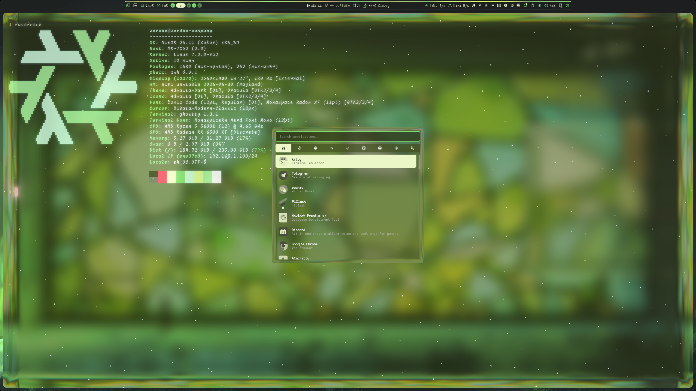
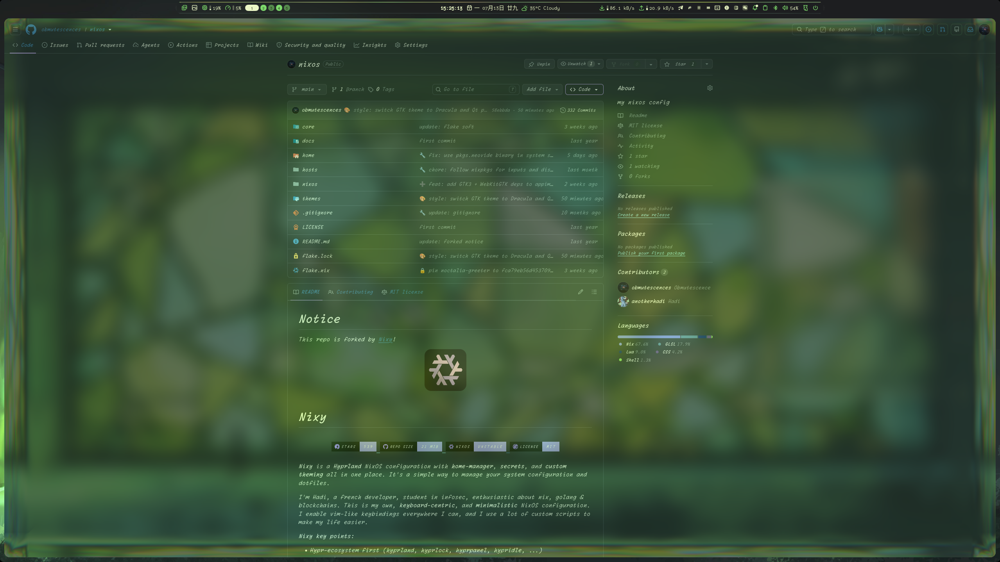

# zerone's NixOS Configuration

<div align="center">
  
  <br/>
  <em>niri + Noctalia Shell + Zen Browser</em>
</div>

<br/>

|                     |                                                                                                                     |
| ------------------- | ------------------------------------------------------------------------------------------------------------------- |
| **Window Manager**  | [niri](https://github.com/YaLTeR/niri) — scrollable-tiling Wayland compositor                                       |
| **Shell**           | Zsh + [oh-my-posh](https://ohmyposh.dev) + [Noctalia v5](https://github.com/noctalia-dev/noctalia) (C++ Luau shell) |
| **Browser**         | [Zen Browser](https://zen-browser.app/) (firefox-based, wayland-native)                                             |
| **Code Editor**     | [Neovim](https://neovim.io/) + [Neovide](https://neovide.dev/) (GUI)                                                |
| **Terminal**        | Ghostty (primary) / Kitty / Alacritty                                                                               |
| **Display Manager** | SDDM + [Noctalia Greeter](https://github.com/noctalia-dev/noctalia-greeter) (Wayland)                               |
| **Lockscreen**      | qylock (Quickshell-based lockscreen)                                                                                |
| **Launcher**        | wofi / tofi                                                                                                         |
| **File Manager**    | Thunar / Yazi (terminal)                                                                                            |
| **PDF Reader**      | Zathura                                                                                                             |
| **Theme System**    | Stylix + custom variables; dynamic theming via matugen (DankMaterialShell)                                          |
| **Input Method**    | Fcitx5 + Rime (flypy) + Fluent theme                                                                                |
| **Network**         | Dae (proxy routing)                                                                                                 |

<br/>

## 🖼 Preview

| Fastfetch & Shell           | Browser & Desktop       |
| --------------------------- | ----------------------- |
|  |  |

---

## 📁 Directory Structure

```
~/.config/nixos/
├── core/                      # Entry-point module imports
│   ├── nixos.nix              #   System-level module imports (audio, bluetooth, docker, niri, dae, etc.)
│   ├── home.nix               #   User-level (home-manager) module imports (programs, scripts, system)
│   └── fhs.nix                #   FHS compatibility (disabled)
│
├── nixos/                     # System-level NixOS modules
│   ├── amd.nix                #   AMD GPU configuration
│   ├── audio.nix              #   PipeWire + WirePlumber (low-latency, AMD ALC897 fix, Bluetooth codecs)
│   ├── auto-upgrade.nix       #   Auto-upgrade (disabled)
│   ├── bluetooth.nix          #   Bluetooth service
│   ├── docker.nix             #   Docker daemon
│   ├── fonts.nix              #   Font packages
│   ├── home-manager.nix       #   Home-manager integration
│   ├── network-manager.nix    #   NetworkManager
│   ├── nix.nix                #   Nix daemon settings (garbage collector, flakes)
│   ├── nvidia.nix             #   NVIDIA GPU configuration
│   ├── programs.nix           #   Global programs: niri, SDDM, Noctalia Greeter, qylock, mouseless, AppImage
│   ├── systemd-boot.nix       #   Boot loader
│   ├── timezone.nix           #   Timezone / locale
│   ├── tuigreet.nix           #   TUI greetd (unused, SDDM used instead)
│   ├── users.nix              #   User accounts
│   ├── utils.nix              #   Utility packages (curl, wget, git, etc.)
│   ├── variables-config.nix   #   Variables abstraction (var.* module)
│   └── xdg-portal.nix         #   XDG Desktop Portal
│
├── home/                      # Home-manager user-level config
│   ├── programs/              #   Application-specific configs
│   │   ├── alacritty/         #     Alacritty terminal
│   │   ├── atuin/             #     Shell history search
│   │   ├── bat/               #     bat (cat with syntax highlighting)
│   │   ├── buckle/            #     Buckle (build tool)
│   │   ├── deps/              #     Dependency packages
│   │   ├── dms/               #     DankMaterialShell (Quickshell bar — currently disabled)
│   │   ├── flameshot/         #     Screenshot tool
│   │   ├── ghostty/           #     Ghostty terminal (primary)
│   │   ├── git/               #     Git configuration
│   │   ├── kitty/             #     Kitty terminal
│   │   ├── lazygit/           #     Git TUI
│   │   ├── matugen/           #     Material You color generator (dynamic theming)
│   │   ├── mydumper/          #     MySQL dump tool
│   │   ├── neovide/           #     Neovim GUI client
│   │   ├── neovim/            #     Neovim (nightly) — the primary code editor
│   │   ├── noctalia/          #     Noctalia v5 shell (C++ Luau shell)
│   │   ├── quickshell/        #     Quickshell (QML-based desktop shell framework)
│   │   ├── shell/             #     Zsh + oh-my-posh + fzf + zoxide + eza
│   │   ├── thunar/            #     Thunar file manager
│   │   ├── wl-kbptr/          #     Wayland keyboard-driven mouse pointer
│   │   └── yazi/              #     Terminal file manager
│   │
│   ├── scripts/               #   Custom scripts
│   │   ├── nerdfont-fzf/      #     Nerd Font picker via fzf
│   │   ├── notification/      #     Notification scripts
│   │   ├── swww/              #     Wallpaper (swww — disabled)
│   │   ├── system/            #     System utility scripts
│   │   └── default.nix        #     Script aggregator
│   │
│   ├── sources/               #   Config files / assets
│   │   ├── fonts/             #     Custom font files
│   │   ├── keybord-sound/     #     Keyboard sound samples
│   │   ├── mouseless-config.yaml
│   │   ├── bluetooth-lowlatency.conf
│   │   ├── 51-bluez-codec.conf
│   │   └── 10-lowlatency.conf
│   │
│   └── system/                #   Desktop environment configs
│       ├── dae/               #     Dae proxy routing service
│       ├── fctix5/            #     Fcitx5 input method (Rime + fluent theme)
│       ├── hyprland/          #     Hyprland config (disabled, migrated to niri)
│       ├── hyprlock/          #     Hyprlock config (disabled)
│       ├── mime/              #     MIME type associations (nvim → text, zen → http/html, imv → images)
│       ├── niri/              #     Niri compositor config + xwayland-satellite
│       ├── tofi/              #     Tofi launcher
│       ├── udiskie/           #     Auto-mount USB drives
│       ├── waybar/            #     Waybar config (disabled, using DMS instead)
│       ├── wofi/              #     Wofi launcher
│       └── zathura/           #     Zathura PDF reader
│
├── hosts/                     # Host-specific configurations
│   ├── home-desktop/          #   Main desktop: AMD + NVIDIA, user "zerone"
│   │   ├── configuration.nix  #     System config
│   │   ├── home.nix           #     Home-manager config
│   │   ├── hardware-configuration.nix
│   │   ├── variables.nix      #     Host variables (hostname, theme, git config, locale)
│   │   ├── pkg.nix            #     Extra packages
│   │   └── profile_picture.png
│   │
│   └── sy-company/            #   Work machine
│       ├── configuration.nix
│       ├── home.nix
│       ├── hardware-configuration.nix
│       ├── variables.nix
│       ├── pkg.nix
│       ├── net.nix            #     Network config
│       └── profile_picture.png
│
├── themes/                    # Theme system
│   ├── stylix/                #   Stylix-generated themes
│   │   ├── 2025.nix           #     Current theme (2025)
│   │   └── ...                #     (archived themes)
│   ├── var/                   #   Manual theme variables
│   │   ├── 2025.nix           #     Rounding, gaps, opacity, blur, font, bar settings
│   │   └── ...                #     (archived themes)
│   └── gtk.nix                #   GTK theme via Stylix
│
├── flake.nix                  # Flake inputs & outputs (niri, zen-browser, noctalia, qylock, etc.)
├── flake.lock                 # Locked flake inputs
├── fastfetch.png              # Preview: terminal + fastfetch + shell
├── browser.png                # Preview: desktop + browser
├── LICENSE                    # MIT License
└── README.md                  # This file
```

---

## 🧩 Software Stack

### Desktop Environment

| Component           | Software                                                                              | Notes                                                                                                               |
| ------------------- | ------------------------------------------------------------------------------------- | ------------------------------------------------------------------------------------------------------------------- |
| **Compositor / WM** | [niri](https://github.com/YaLTeR/niri)                                                | Scrollable-tiling Wayland compositor. GPU-accelerated, dynamically tiling windows in a scrolling column layout.     |
| **Shell**           | [Noctalia v5](https://github.com/noctalia-dev/noctalia)                               | Custom C++ / Luau shell — replaces the traditional DE shell/bar. Provides panels, widgets, and desktop integration. |
| **Lockscreen**      | [qylock](https://github.com/Darkkal44/qylock)                                         | Quickshell-based lockscreen; forest theme.                                                                          |
| **Launcher**        | wofi / tofi                                                                           | Application launchers. wofi (primary), tofi (lightweight alternative).                                              |
| **Notifications**   | (custom scripts)                                                                      | Lightweight notification scripts.                                                                                   |
| **Display Manager** | SDDM (Wayland) + [Noctalia Greeter](https://github.com/noctalia-dev/noctalia-greeter) | Wayland-native greeter.                                                                                             |
| **Idle / DPMS**     | (niri built-in + qylock)                                                              | Niri handles idle inhibition; qylock triggers on idle.                                                              |
| **Screenshot**      | Flameshot                                                                             | Region/screen capture + annotation.                                                                                 |
| **Clipboard**       | wl-clipboard (via wl-kbptr)                                                           | Wayland clipboard utilities.                                                                                        |

### Applications

| Category           | Software                                            | Notes                                                                   |
| ------------------ | --------------------------------------------------- | ----------------------------------------------------------------------- |
| **Browser**        | [Zen Browser](https://zen-browser.app/)             | Firefox-based, Wayland-native, minimal UI. Default for http/https/html. |
|                    | Google Chrome                                       | Secondary browser.                                                      |
|                    | Firefox                                             | Also installed as fallback.                                             |
| **Code Editor**    | [Neovim](https://neovim.io/) (nightly)              | Primary editor; default for all text/code MIME types.                   |
|                    | [Neovide](https://neovide.dev/)                     | Neovim GUI client with smooth animations.                               |
| **Terminal**       | [Ghostty](https://ghostty.org/)                     | Primary terminal emulator.                                              |
|                    | Kitty                                               | Secondary terminal (used for `icat` image preview and SSH kitten).      |
|                    | Alacritty                                           | Lightweight fallback GPU-accelerated terminal.                          |
| **File Manager**   | Thunar                                              | GUI file manager (default for directories).                             |
|                    | [Yazi](https://yazi-rs.github.io/)                  | Terminal file manager (TUI, vim-like keybindings).                      |
| **PDF**            | Zathura                                             | Minimal PDF reader with vim keys.                                       |
| **Image Viewer**   | imv / imv-dir                                       | Lightweight Wayland-native image viewer.                                |
| **Media**          | VLC / MPV                                           | Video/audio playback.                                                   |
| **System Monitor** | btop                                                | Terminal resource monitor.                                              |
| **Git GUI**        | [lazygit](https://github.com/jesseduffield/lazygit) | Terminal Git UI.                                                        |
| **Shell Search**   | [atuin](https://atuin.sh/)                          | Shell history with search and sync.                                     |
| **Font Viewer**    | (nerdfont-fzf script)                               | Browse & preview Nerd Fonts via fzf.                                    |

### Shell (Zsh)

| Plugin/Feature              | Purpose                                    |
| --------------------------- | ------------------------------------------ |
| **oh-my-posh**              | Prompt theming (custom JSON theme)         |
| **zoxide**                  | Smart `cd` — `z` jumps to directories      |
| **eza**                     | Modern `ls` replacement with icons         |
| **fzf**                     | Fuzzy finder (Ctrl+R history, file search) |
| **bat**                     | Syntax-highlighted `cat` replacement       |
| **ripgrep**                 | Blazing-fast `grep` replacement            |
| **zsh-autosuggestion**      | Command history autocomplete               |
| **zsh-syntax-highlighting** | Real-time syntax coloring                  |

### Input Method (Fcitx5)

| Component              | Purpose                                         |
| ---------------------- | ----------------------------------------------- |
| **Fcitx5**             | Input method framework                          |
| **Rime** (fcitx5-rime) | Chinese IME engine with flypy (小鹤双拼) schema |
| **Fluent theme**       | Modern rounded dark theme                       |
| **Wayland frontend**   | Native Wayland support enabled                  |

### Network & Proxy

| Component          | Purpose                                                          |
| ------------------ | ---------------------------------------------------------------- |
| **Dae**            | eBPF-based transparent proxy routing (v2ray-geoip + domain-list) |
| **NetworkManager** | Standard network management                                      |

### Audio

| Component              | Purpose                                                        |
| ---------------------- | -------------------------------------------------------------- |
| **PipeWire**           | Modern audio server (replaces PulseAudio)                      |
| **WirePlumber**        | Session/policy manager                                         |
| **Low-latency config** | 128 quantum / 48kHz, optimized for Bluetooth A2DP (AAC/SBC-XQ) |
| **AMD ALC897 fix**     | Custom ALSA rules to fix headphone jack detection              |

### Theme System

| Component            | Purpose                                                                             |
| -------------------- | ----------------------------------------------------------------------------------- |
| **Stylix**           | Auto-generates GTK, Qt, and terminal themes from wallpaper                          |
| **matugen**          | Material You color extraction (DMS dynamic theming)                                 |
| **Custom variables** | Rounding (14px), gaps (3/5), opacity, blur, font (Monaspace Radon NF), bar position |

### Development Tools

| Tool            | Purpose                                |
| --------------- | -------------------------------------- |
| **Python 3.14** | + pip, ipython, pylatexenc             |
| **Node.js**     | JavaScript runtime                     |
| **pnpm**        | Fast Node.js package manager           |
| **Rye**         | Python project manager                 |
| **Uv**          | Fast Python package installer          |
| **Just**        | Command runner (like Make, but better) |
| **Go**          | (via `$HOME/go/bin` in PATH)           |
| **Rust**        | (via `$HOME/.cargo/bin` in PATH)       |

---

## 🖥️ Hosts

### home-desktop (`zerone-home`)

- **Main desktop** — AMD + NVIDIA dual-GPU
- User: zerone
- Primary system with full desktop environment

### sy-company (`zerone-company`)

- **Work machine** — separate config for company environment
- Custom networking (net.nix)
- Same base system with host-specific packages

---

## 🛠️ Useful Commands

```sh
# Rebuild system
sudo nixos-rebuild switch --flake ~/.config/nixos#zerone-home

# Rebuild home-manager only
home-manager switch --flake ~/.config/nixos#zerone-home

# Quick navigation
cnf   # alias: cd ~/.config/nixos

# Fastfetch preview
fastfetch

# Apply theme colors (matugen)
matugen image ~/wallpaper.png
```

---

## 📜 License

MIT — originally forked from [Nixy](https://github.com/anotherhadi/nixy), extensively customized.
